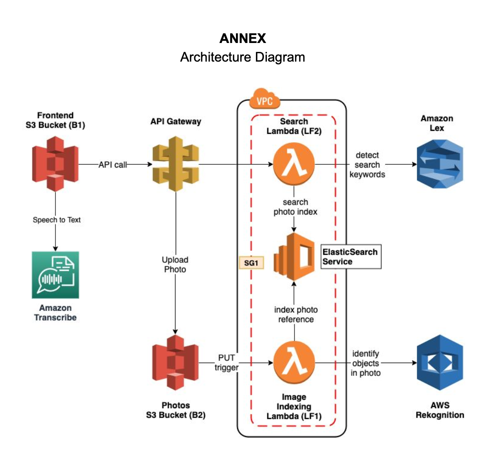
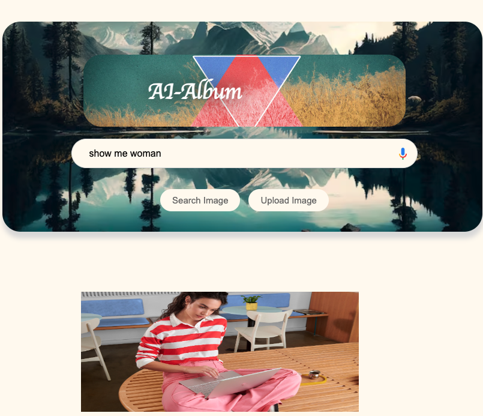
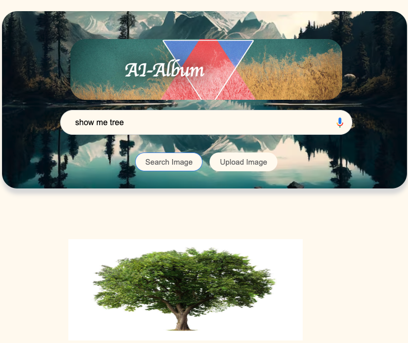

# aws-ai-album
Assignment 3 for Cloud-Computing-AWS-CSGY-9223
## System Diagram

## How to use

1. deploy the stack
```bash
export AWS_DEFAULT_PROFILE=terraform
export AWS_DEFAULT_REGION=us-east-1
./cloudformation/run.sh <GITHUB_TOKEN_1>
# wait for the LF1 and LF2 get created on cloud before running the following command
./cloudformation/run2.sh
```

2. Update apigateway SDK by replacing the `frontend/apigClient.js` file with the one downloaded from the apigateway console.

3. Tear down the stack
```bash
./cloudformation/run.sh -d
./cloudformation/run2.sh -d
```

## Demo

